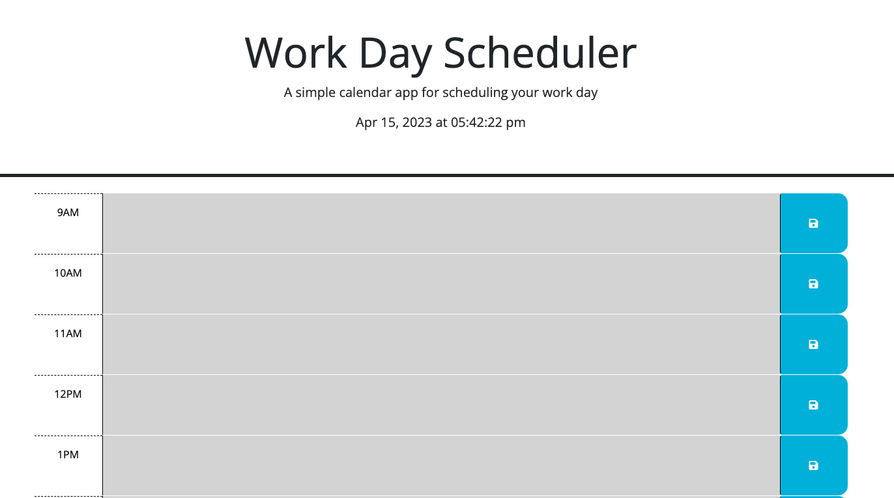
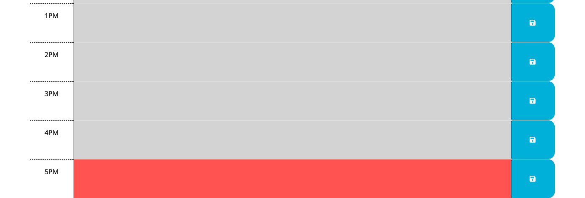

# Workday Scheduler 
## Description
This application allows you to keep track of what you plan to work on each work hour. 

Any timeblocks in the past are gray, the present is red, and the future hours are in green. 

The current time is available at the top of the page. 
## Instructions
Click into a timeblock and type in something you are planning on working on that hour. 

Then click the save button to save your input. 
## Credits 
HTML and CSS provided as starter code in this activity. I had assistance with the JS from at tutor at UNC. 

This also used Bootstrap, day.js, and jQuery libraries. 
## Screenshot

You can see here that it was currently 5pm, so that timeblock is red.

## Link to Repo & Deployed Application
Link to Repo:
https://github.com/anicrob/daily-planner-5 

Link to Deployed application:
https://anicrob.github.io/daily-planner-5/ 
